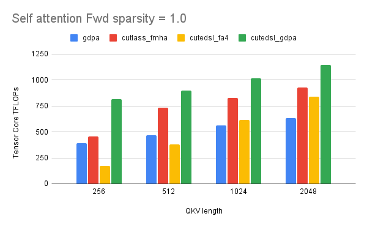
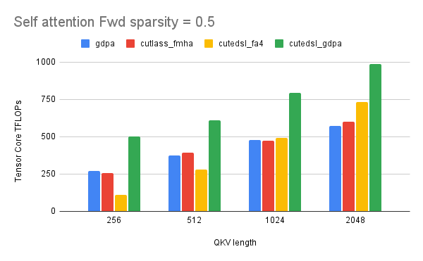
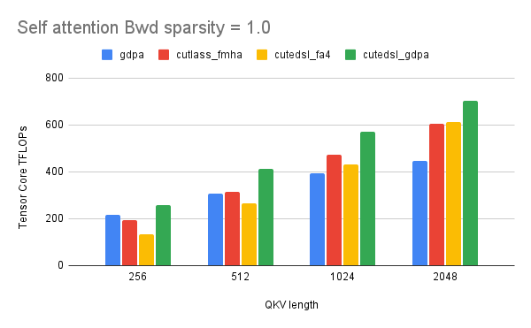
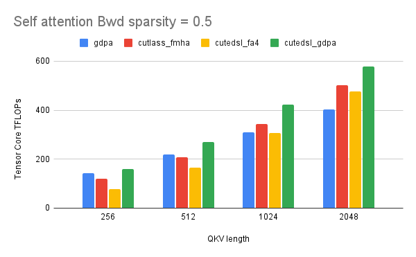
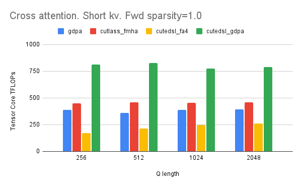
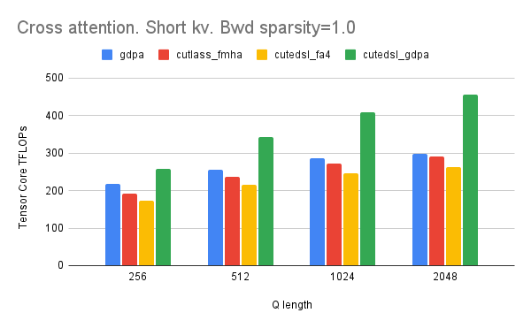

# Generalized Dot Product Attention (GDPA)

This repo provides the kernel implementation of Generalized Dot Product Attention (GDPA), a variant of standard dot-product attention (SDPA) in which the softmax operation is replaced by different activation functions to support diverse interaction use cases, as proposed in the following papers from Meta: [Kunlun](https://arxiv.org/abs/2602.10016) and [InterFormer](https://arxiv.org/abs/2411.09852). GDPA is used in Meta's Generative Ads Model ([GEM](https://engineering.fb.com/2025/11/10/ml-applications/metas-generative-ads-model-gem-the-central-brain-accelerating-ads-recommendation-ai-innovation/)), Meta's largest RecSys training foundation model. The kernels are built upon [Flash Attention 4](https://github.com/Dao-AILab/flash-attention) (FA4) and [NVIDIA CUTE-DSL](https://github.com/NVIDIA/cutlass), with workload-driven optimizations tailored to large-batch training, variable sequence lengths, and non-softmax activations.

**[Paper] Kunlun: Establishing Scaling Laws for Massive-Scale Recommendation Systems through Unified Architecture Design**
Xiaoyi Liu, Jiaqi Xu, etc, Meta Ads AI, 2026
Paper: https://arxiv.org/abs/2602.10016

**[Blog] Generalized Dot Product Attention: Tackling Real-World Challenges in GPU Training Kernels**
Jiaqi Xu, Chao Chen, Shuqi Yang, Markus Hoehnerbach, Xiaoyi Liu, Jacky Zhou, Dev Shankar, Tri Dao, etc, Meta Ads AI, Meta Codesign, Princeton University, 2026
Will be published soon.

## Benchmark Results

All benchmarks in this blog are run on NVIDIA B200 GPUs (~180 GB HBM, CUDA 13.0) on Meta internal clusters, with a power cap of 750 W per GPU and default GPU clocks.

We report kernel-level performance using Tensor Core throughput (TFLOPs) and relative speedup over baseline implementations. We evaluate several GDPA kernel variants, including:

- **Triton GDPA (Baseline).** A Triton-based implementation derived from Triton templates, serving as our primary baseline.
- **CUTLASS FMHA.** The FMHA kernel from CUTLASS that currently runs on Blackwell GPUs.
- **FA4 kernel.** The FlashAttention-4 kernel, whose design we build upon and adapt for GDPA in this blog.
- **CuteDSL GDPA (ours).** The optimized GDPA kernel developed in this work, based on the CuteDSL attention kernel and tailored for real-world GDPA training workloads.

Overall, under certain real-world production traffic settings, our approach achieves up to **3.5x forward** and **1.6x backward** speedup compared to FA4. More details can be found in our blog (coming soon).














## Features

- **Datatypes:** BF16, FP16, FP8 (E4M3) forward | MXFP4 and MXFP8 forward & backward (coming soon)
- **Attention:** Causal, non-causal, sliding window
- **Head configs:** MHA, GQA, MQA | Head dims: 64, 96, 128, (192, 128) on Blackwell
- **Variable-length sequences** with jagged tensor support
- **Custom activations:** GELU, GELUApprox, FastGELU, FastGELU (BF16), ReLU, ReLU², LeakyReLU, SiLU, FastSiLU, HardSwish, identity
- **Zigzag tile scheduling** for load-balanced jagged inputs
- **Outer-loop software pipelining** for short K/V sequences

## Supported Kernels

| Kernel | Ampere (SM80) | Hopper (SM90) | Blackwell (SM100) | Path |
|--------|:---:|:---:|:---:|------|
| CUTE-DSL | | | x | `gdpa/src/` |
| Triton | x | x | x | `gdpa/triton/` |

### CUTE-DSL

```python
from gdpa.src.interface import flash_attn_func, flash_attn_varlen_func

# Fixed-length batched attention
out, lse = flash_attn_func(q, k, v, softmax_scale=scale, causal=False)

# Variable-length attention
out, lse = flash_attn_varlen_func(
    q, k, v, cu_seqlens_q=cu_q, cu_seqlens_k=cu_k,
    max_seqlen_q=max_q, max_seqlen_k=max_k, activation="fast_gelu",
)
```

### Cross-kernel benchmark (OSS)

Compare CuteDSL GDPA against Triton GDPA, CUTLASS Blackwell FMHA, and Flash Attention v4 on Blackwell GPUs.

**Prerequisites:** NVIDIA Blackwell GPU (B200/B100/GB200), CUDA 12.8+, conda

#### 1. Install dependencies

```bash
conda create -n gdpa-bench python=3.12 -y
conda activate gdpa-bench
pip install -r ads_mkl/ops/cute_dsl/gdpa/scripts/requirements.txt
```

#### 2. Install Flash Attention v4 (CuTe DSL)

The CuTe DSL FA4 kernel is a pure Python module that uses `nvidia-cutlass-dsl` for JIT compilation at runtime. Install from the latest GitHub main branch (the PyPI release may not be compatible with the latest `cutlass-dsl`):

```bash
FLASH_ATTENTION_SKIP_CUDA_BUILD=TRUE pip install \
    git+https://github.com/Dao-AILab/flash-attention.git --no-build-isolation
```

Then create the `cutlass.utils.ampere_helpers` compatibility shim (removed in cutlass-dsl 4.4.0 but still referenced by flash-attn):

```bash
CUTLASS_UTILS_DIR=$(python -c 'import cutlass.utils, os; print(os.path.dirname(cutlass.utils.__file__))')
cat > "$CUTLASS_UTILS_DIR/ampere_helpers.py" << 'EOF'
SMEM_CAPACITY = {
    "sm80": 163840, "sm86": 102400, "sm89": 102400,
    "sm90": 232448, "sm100": 229376,
}
EOF
```

Skip this step if you only want to benchmark the other 3 kernels.

#### 3. Enable Triton GDPA (requires `tl.async_task`)

The Triton GDPA kernel uses warp specialization via `tl.async_task`, which is available in [facebookexperimental/triton](https://github.com/facebookexperimental/triton) but not in the upstream PyPI `triton` package. To enable it:

```bash
# Clone only the TLX module (sparse checkout)
git clone --depth 1 --filter=blob:none --sparse \
    https://github.com/facebookexperimental/triton.git /tmp/fb-triton
cd /tmp/fb-triton && git sparse-checkout set third_party/tlx/language/tlx && cd -

# Patch installed triton with TLX
TRITON_DIR=$(python -c 'import triton, os; print(os.path.dirname(triton.__file__))')
mkdir -p "$TRITON_DIR/language/extra"
[ -f "$TRITON_DIR/language/extra/__init__.py" ] || echo "" > "$TRITON_DIR/language/extra/__init__.py"
ln -sf /tmp/fb-triton/third_party/tlx/language/tlx "$TRITON_DIR/language/extra/tlx"
sed -i '/^from \. import extra$/a from .extra.tlx import async_task, async_tasks' \
    "$TRITON_DIR/language/__init__.py"
```

Skip this step if you only want to benchmark the other 3 kernels — the benchmark handles missing kernels gracefully.

#### 4. Run the benchmark

```bash
python ads_mkl/ops/cute_dsl/gdpa/scripts/benchmark.py bench-fwd
```

#### Kernel availability

| Kernel | Package | Notes |
|--------|---------|-------|
| CuteDSL GDPA | `nvidia-cutlass-dsl` | Always available |
| Triton GDPA | `triton` + TLX patch | Requires step 2 above |
| CUTLASS FMHA | `fbgemm-gpu-genai` | Separate package from `fbgemm-gpu` |
| CuteDSL FA4 | `flash-attn` | [Dao-AILab/flash-attention](https://github.com/Dao-AILab/flash-attention) |

### Triton

```python
from gdpa.triton.triton_generalized_dot_product_attention import generalized_dot_product_attention

out = generalized_dot_product_attention(
    query, key, value,
    query_offset=q_off, key_offset=k_off,
    max_seq_len_q=max_q, max_seq_len_kv=max_kv,
    activation="fast_gelu",
)
```

## Quick Start

```bash
# Clone the repo
git clone https://github.com/facebookresearch/gdpa.git
cd gdpa
pip install nvidia-cutlass-dsl>=4.1.0 torch einops

# Run BF16 benchmark
python tests/benchmark_attn.py

```

## License

Apache License 2.0

## Acknowledgments

GDPA builds upon [Flash Attention V4](https://github.com/Dao-AILab/flash-attention) by Tri Dao et al.

## Citation

```bibtex
@article{hou2025kunlun,
  title={Kunlun: Establishing Scaling Laws for Massive-Scale Recommendation Systems through Unified Architecture Design},
  author={Bojian Hou and Xiaolong Liu and Xiaoyi Liu and Jiaqi Xu and others},
  journal={arXiv preprint arXiv:2602.10016},
  year={2025}
}
```

## References

- [Kunlun: Establishing Scaling Laws for Massive-Scale Recommendation Systems](https://arxiv.org/abs/2602.10016)
- [Flash Attention](https://github.com/Dao-AILab/flash-attention)
- [FlashAttention-3](https://arxiv.org/abs/2407.08608)
- [NVIDIA CUTLASS](https://github.com/NVIDIA/cutlass)
- [InterFormer](https://arxiv.org/abs/2411.09852)
